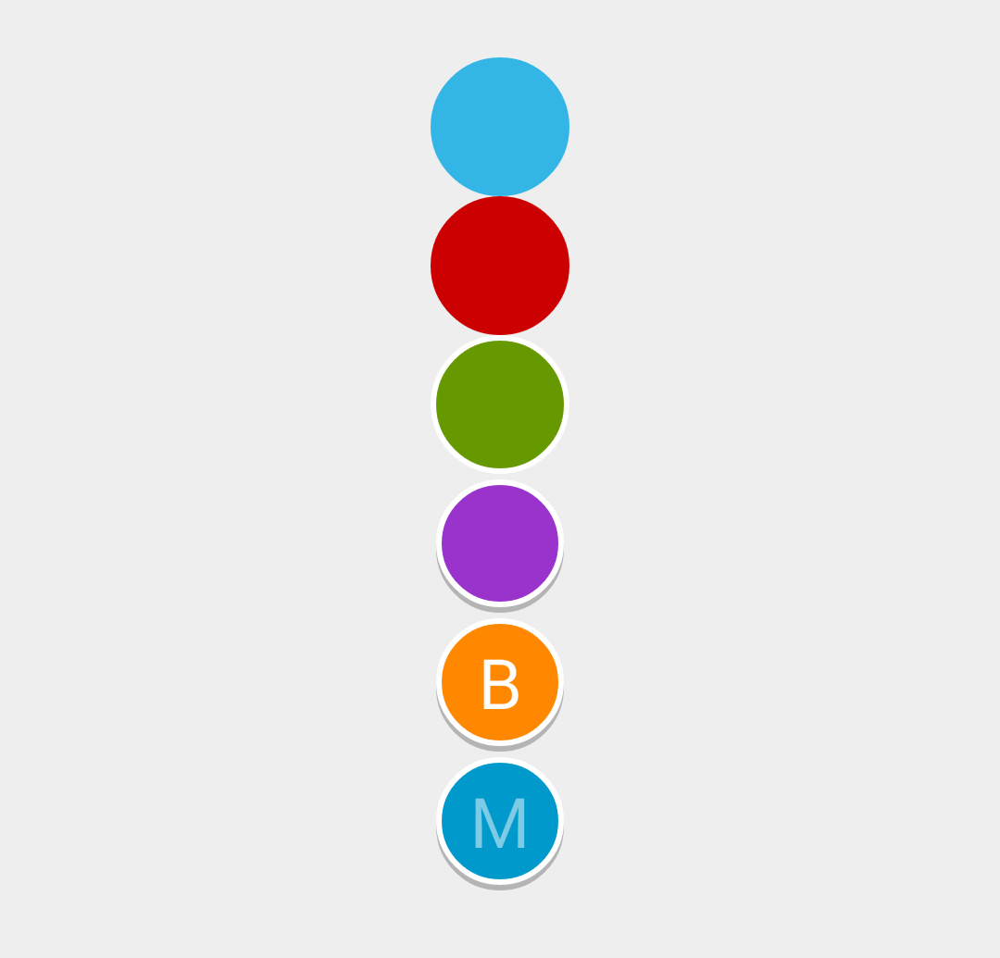

LetterCircleView
================

The LetterCircleView is an Android Widget that shows a letter inside
a Circle. This widget is customizable: the size and the color of the 
circle, the shadow, the border and the letter can be customized.




Download
========

Download:

Maven:

Gradle:


Usage
=====

Declaratively:

```xml
<com.bytoaster.widget.LetterCircleView
    android:text="M"
    android:textColor="@color/white"
    android:textSize="25dp"
    widget:textAlpha="125"
    android:layout_width="50dp"
    android:layout_height="50dp"
    widget:contentColor="@color/dark_blue"
    widget:borderColor="@color/white"
    widget:borderSize="2dp"
    widget:shadowColor="@color/grey_B4"
    widget:shadowSize="2dp"/>
```


Programmatically:


```xml
<com.bytoaster.widget.LetterCircleView
    android:id="@+id/circle"
    android:layout_width="50dp"
    android:layout_height="50dp"/>
```

```java
final LetterCircleView circle = (LetterCircleView)findViewById(R.id.circle);
circle.setText("M");
circle.setTextColor(getResources().getColor(R.color.white));
circle.setTextSize(25);
circle.setTextAlpha(122);
circle.setContentColor(getResources().getColor(R.color.dark_blue));
circle.setBorderColor(getResources().getColor(R.color.white));
circle.setBorderSize(2);
circle.setShadowColor(getResources().getColor(R.color.grey_B4));
circle.setShadowSize(2);
```

See the source of the "example" module for more examples.

The corresponding APK is also available on the Play Store (soon).


License
=======

```
Copyright 2014 Jean-Baptiste Chaput

Licensed under the Apache License, Version 2.0 (the "License");
you may not use this file except in compliance with the License.
You may obtain a copy of the License at

   http://www.apache.org/licenses/LICENSE-2.0

Unless required by applicable law or agreed to in writing, software
distributed under the License is distributed on an "AS IS" BASIS,
WITHOUT WARRANTIES OR CONDITIONS OF ANY KIND, either express or implied.
See the License for the specific language governing permissions and
limitations under the License.
```